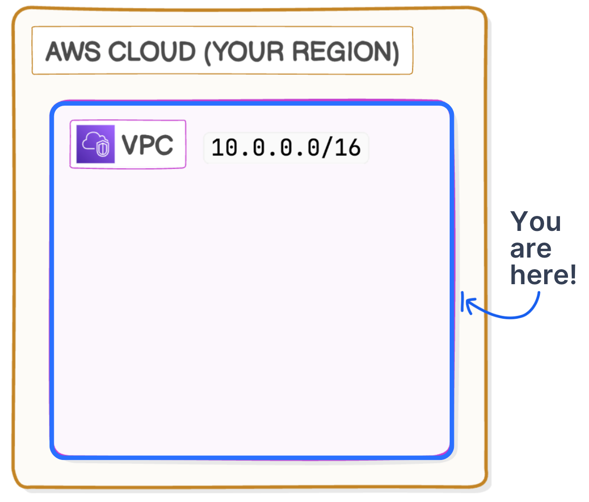
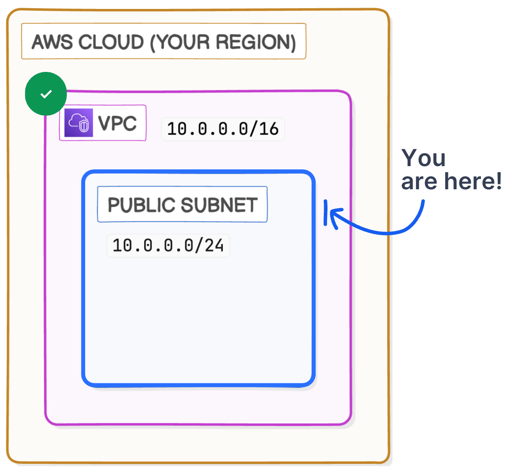
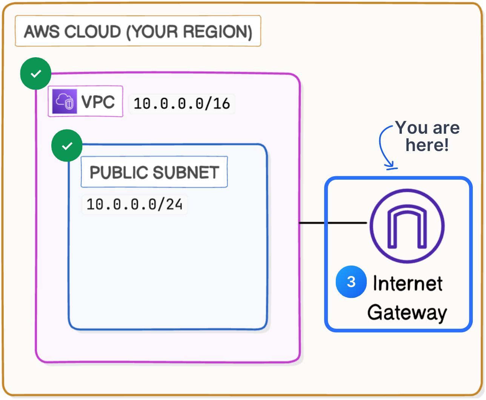

# Build-a-Virtual-Private-Cloud
This project demonstrates how to set up an Amazon Virtual Private Cloud (VPC), including the configuration of subnets and an internet gateway. The purpose of this project was to create a customizable network space within AWS, allowing for isolation, security, and control over network configurations.

## What is Amazon VPC?

Amazon Virtual Private Cloud (VPC) is a customizable network space in AWS that enables the launch of AWS resources in a virtual network. It provides developers and teams with isolation, security, and the ability to control their network configurations.

 
## Project Details

### Time to Complete

This project took me less than an hour to complete. The quick setup and configuration process was a pleasant surprise.

### How I Used Amazon VPC

In this project, I used Amazon VPC to:
- Create a customizable network space in AWS.
- Set up subnets to organize resources within the VPC.
- Attach an internet gateway to allow instances within the VPC to connect to the internet.

### Key Components

#### 1. **Virtual Private Cloud (VPC)**
   - **Concept**: VPCs are a single-tenant concept that allows you to create a private space within the public cloud's architecture.
   - **Setup**: I defined an IPv4 CIDR (Classless Inter-Domain Routing) block for my VPC. A default VPC existed in my account, which AWS automatically created when my account was set up.

 

#### 2. **Subnets**
   - **Description**: Subnets are regional resources with associated IP address ranges. My account already had subnets for every Availability Zone (AZ) in my region.
   - **Setup**: I created a subnet named `Public 1`. For a subnet to be considered public, it must have a route in its route table directing traffic destined for the internet to an internet gateway.

 

#### 3. **Internet Gateway**
   - **Description**: Internet gateways are AWS-managed resources that enable instances within a VPC to connect to the internet.
   - **Setup**: Attaching an internet gateway to my VPC enabled internet connectivity for instances with public IP addresses.

 

## Challenges and Learnings

### Unexpected Aspects

One thing I didn't expect was how quickly I could set up and configure a VPC with subnets and an internet gateway on AWS. The process was straightforward and well-documented.

## Conclusion

This project provided valuable insights into the setup and configuration of a Virtual Private Cloud on AWS. The ability to customize the network space and control the flow of traffic within the VPC is a powerful feature that can be leveraged in various cloud-based projects.

---

### Additional Notes

I deleted the resources from my AWS console to avoid costs, so this GitHub repository serves as the sole showcase for my work on this project. 
I have documented all the steps and details to ensure a comprehensive understanding of my approach.
